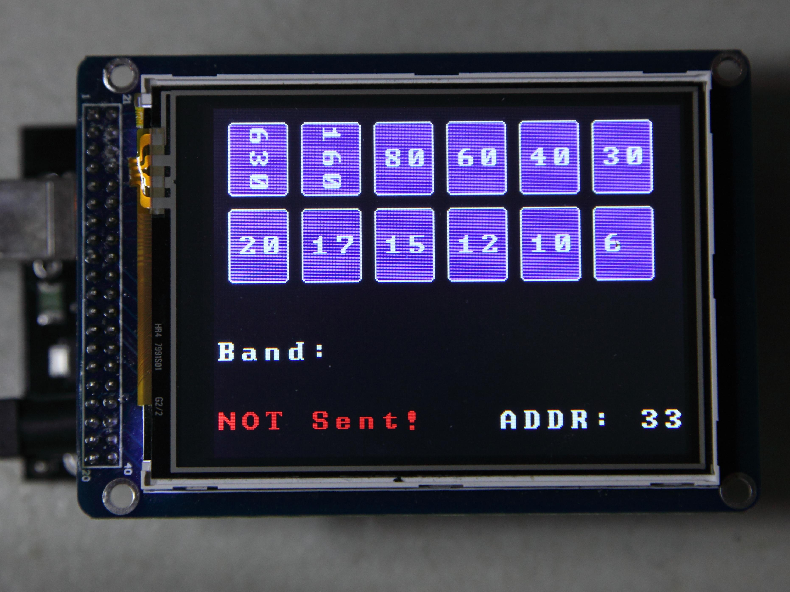

# Arduino Sketches for Hardware Control

To enable simple tests of our TRX and RX filter boards we've developed some Arduino sketches.\\
They allow the controlling of the hardware via the I2C bus together with an Arduino Mega 2560 and a TFT touchscreen.

The related sourcecode of the Arduino sketch for the Charly 25LC TRX board is available here:

[Charly 25LC board tester sourcecode](https://github.com/Charly25-SDR/arduino-sketches/tree/master/Charly_25LC_Tester_V1_2)

The related sourcecode of the Arduino sketch for the Charly 25AB TRX board is available here:

[Charly 25AB board tester sourcecode](https://github.com/Charly25-SDR/arduino-sketches/tree/master/Charly_25AB_Tester_V1_2)

And here's a picture of the Arduino sketch for the RX bandpass filter board:

The related sourcecode of this Arduino sketch is available here:

[Charly 25 RX BPF board tester sourcecode](https://github.com/Charly25-SDR/arduino-sketches/tree/master/Charly_25_RX_BPF_Board_Tester_V1_2)
